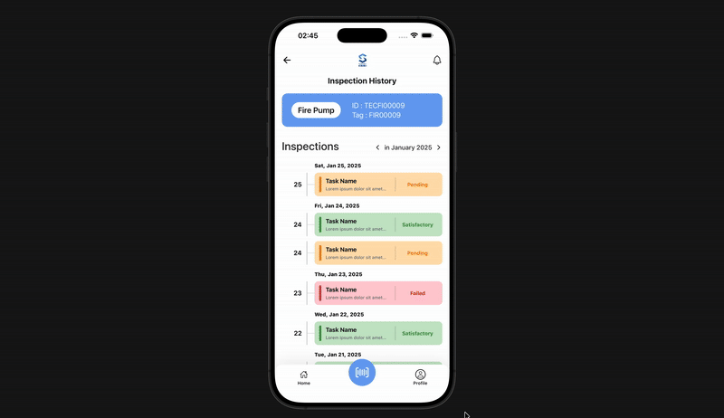
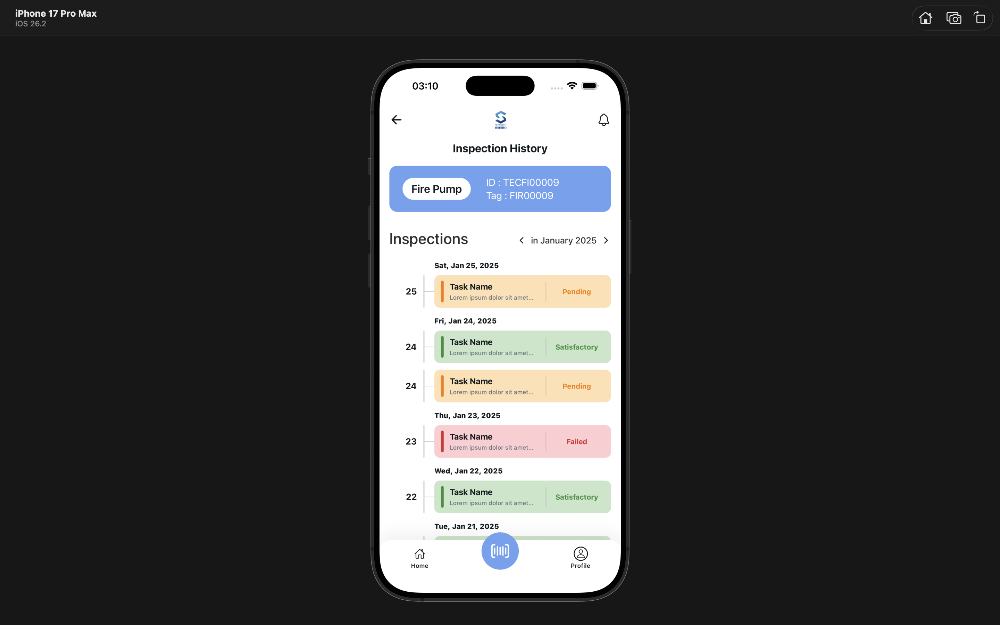

# Inspection History Screen (React Native + Expo)

This repository contains an **Inspection History screen** implemented as part of a React Native assignment.  
The focus of the work is **UI accuracy**, **clean local data handling**, and **maintainable code**, while strictly following the provided constraints.

---

## Features

Core requirements and selected optional enhancements implemented:

- Inspection History list grouped by day with **sticky date headers**
- Local mock data with **month-based filtering** (previous / next month)
- Status-based UI for **Satisfactory / Pending / Failed**
- **Today’s inspection** highlighted subtly
- **Pull-to-refresh** (simulated)
- Subtle **row entry animations** (fade / slide)
- Bottom tab bar with a **floating Scan button** (UI-only)

---

## Media

**Quick preview (GIF)**  


**Static UI screenshot**  


**High-resolution walkthrough (video)**  
[Watch full demo](assets/Video_Preview.mov)

---

## Tech Stack

- React Native
- Expo
- Expo Router (file-based routing)
- `expo/vector-icons` (icons only; no UI libraries used)
- `dayjs` for date formatting and grouping

---

## Project Structure

- Inspection History screen: `app/(tabs)/index.tsx`
- Bottom tabs & floating Scan button: `app/(tabs)/_layout.tsx`
- Local mock data & month filter helper: `mockData.js`

---

## Development

Install dependencies:

```bash
npm install


Run the app:

```bash
npm run start
```

Platform shortcuts:

```bash
npm run ios
npm run android
npm run web
```

Lint:

```bash
npm run lint
```

### Notes

- Month navigation uses `getInspectionsByMonth(year, month)` where `month` is **1–12**.
- The **Scan button** is implemented as a **visual element only**, as required by the assignment scope.
- The **Profile tab** is intentionally visible but disabled (UI-only).
- Header back and notification buttons are currently no-ops, per instructions.

## Summary

This project intentionally avoids over-engineering and external UI libraries, focusing instead on correctness, clarity, and adherence to the assignment requirements.
